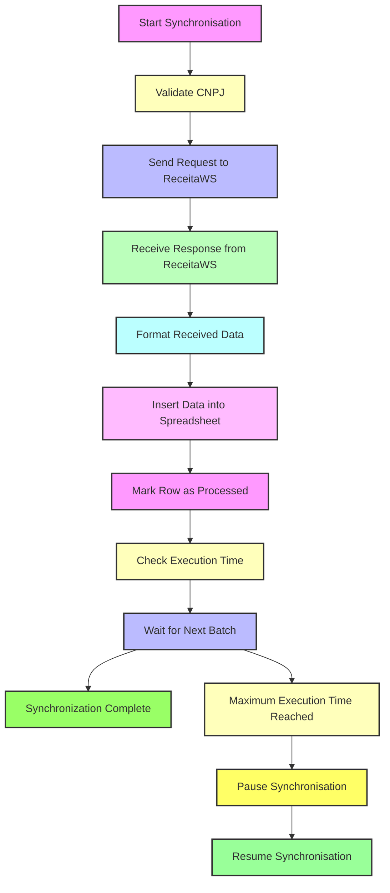

# SincroMEI Google Sheets Add-on


## Overview

The **SincroMEI Google Sheets Add-on** allows you to synchronise data from the SincroMEI API directly into Google Sheets. This tool is designed to streamline the integration and management of MEI data from the Brazilian Federal Revenue Service.



## Features

-   **Synchronise MEI Data**: Automatically fetch and populate MEI data in Google Sheets.
-   **Rate Limiting**: Built-in rate limiting to prevent overloading the API.
-   **Data Validation**: Ensures valid CNPJ formats and handles errors gracefully.
-   **Logging**: Comprehensive logging for monitoring and troubleshooting.
-   **Configurable**: Easily set up and customise the spreadsheet.

## Installation

### Prerequisites

-   Node.js 14.17.0 or higher
-   Google Apps Script environment for the Google Sheets add-on
-   A valid API key from ReceitaWS

### Steps

1. **Clone the repository**

    ```bash
    git clone https://github.com/takk8is/sincromei.git
    cd sincromei
    ```

2. **Install dependencies**

    ```bash
    npm install
    ```

3. **Set up environment variables**
   Create a `.env` file in the root directory and add your API key:

    ```
    API_PORT=8001
    API_URL=your_api_url_here
    RECEITAWS_API_KEY=your_api_key_here
    ```

4. **Start the server**

    ```bash
    npm start
    ```

5. **Set up Google Apps Script**
    - Copy the contents of `Code.gs` into a new Google Apps Script project linked to your Google Sheets.
    - Deploy the script as a web app or execute functions directly from the Google Apps Script editor.

## Usage

### Google Sheets Add-on

1. **Open your Google Sheets**
2. **Access the SincroMEI menu**
    - Configure your spreadsheet by selecting `Configurar Planilha`.
    - Start the synchronisation by selecting `Iniciar Sincronização`.
    - Pause the synchronisation by selecting `Pausar Sincronização`.

### API Endpoints

-   **Health Check**

    ```http
    GET /health
    ```

    Check the health status of the API.

-   **Fetch MEI Data**
    ```http
    GET /sincromei/:cnpj
    ```
    Fetch MEI data for a given CNPJ.

## Contributing

We welcome contributions! Please follow these steps:

1. Fork the repository.
2. Create your feature branch (`git checkout -b feature/AmazingFeature`).
3. Commit your changes (`git commit -m 'Add some AmazingFeature'`).
4. Push to the branch (`git push origin feature/AmazingFeature`).
5. Open a Pull Request.

## License

This project is licensed under the Creative Commons Attribution 4.0 International License. See the [LICENSE](LICENSE) file for more details.

## Support

If you have any questions or need support, please open an issue on [GitHub](https://github.com/takk8is/sincromei/issues).

## Donate

Support the project with USDT (TRC-20):

```
TGpiWetnYK2VQpxNGPR27D9vfM6Mei5vNA
```

Feel free to adjust any sections to better fit the specific needs or style preferences of your repository.

## About Takk™ Innovate Studio

Leading the Digital Revolution as the Pioneering 100% Artificial Intelligence Team.

-   Copyright (c) Takk™ Innovate Studio
-   Author: David C Cavalcante
-   Email: say@takk.ag
-   LinkedIn: https://www.linkedin.com/in/hellodav/
-   Medium: https://medium.com/@davcavalcante/
-   Website: https://takk.ag/
-   Twitter: https://twitter.com/takk8is/
-   Medium: https://takk8is.medium.com/
